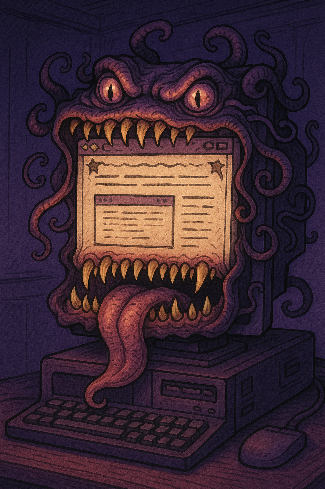

# Mimic

## What is Mimic?
A web tool for composing and previewing reusable design systems against realistic app layouts.

Mimic is framed as a small laboratory for mimic specimens: experts tune each specimen through its color imbuement, design substrate, and layout form.

Mimic separates a design system into two major pieces:

- **Color schemes** answer “what color serves this purpose?”
- **Design languages** answer “what should the interface feel like?”

This lets the same color scheme run through different component treatments, layouts, and surface styles.

## Design languages

Mimic currently includes these original design languages:

- **Hexware** — angular arcane-tech, clipped panels, hot/cold borders, luminous controls, and ritual geometry.
- **Cloud Spire** — atmospheric architecture with opaque lifted components, soft rounded panels, and scheme-derived rim/halo shadows.
- **Aquacore** — liquid-memory interface core with rounded reflective layers, ripple-like depth, and fluid surfaces.

Design languages do not define their own independent colors. They derive highlights, shadows, borders, and effects from the active color scheme.

## Color schemes

Mimic originals are modifier-style color schemes:

- **Astral** — dark cosmic surfaces with punchy blue, pink, and orange accents.
- **Obsidian** — dark volcanic glass with restrained metallic grey sheen and muted accents.
- **Ember** — fire-lit oranges and warm forge surfaces.
- **Tidal** — oceanic blues and cyan current accents.
- **Frost** — icy greys and pale blues for a freezing-over feel.
- **Verdant** — living greens for growth, notes, and renewal.
- **Heavenly** — light pearl-sky surfaces with celestial blues and warm gold actions.

Mimic also includes popular palette mappings, grouped separately in the UI:

- Catppuccin Latte, Frappé, Macchiato, and Mocha
- Dracula
- Tokyo Night, Storm, Moon, and Day
- Nord
- Solarized Dark and Light
- Gruvbox Dark/Light variants
- Iceberg Dark and Light

## Purpose-based color roles

Color schemes use purpose-based roles instead of vibe names. Examples include:

- `backgroundCanvas`
- `surfacePanel`
- `textPrimary`
- `actionPrimary`
- `textOnPrimaryAction`
- `actionSecondary`
- `stateSuccess`
- `stateDanger`
- `borderSubtle`
- `borderFocus`

This prevents one color from doing multiple jobs, such as using a hover color as button text.

## Typography and site treatments

The main display includes extra site-wide tweaks beyond colors and substrates:

- **Typography** — a curated font library controls the specimen’s voice. The top search field filters the curated list by name, mood, and description.
- **Site treatment** — global field effects such as clear, capture film, or resonance alter the whole shell without changing the selected color scheme.

## Layout previews

The theme tooling is embedded into the selected app layout instead of living as a separate control panel. Layout names stay practical, while their descriptions take creative license around each layout form. Current layouts include:

- **Left Sidebar** — configuration lives in the app’s left sidebar.
- **Command Deck** — search leads the top of the app; configuration sits in an integrated deck below it.
- **Left and Right Sidebars** — navigation on the left, configuration on the right.
- **Right Sidebar** — main content with configuration on the right.

## Theme management

Mimic supports:

- Applying color schemes and design languages to the entire app shell.
- Tweaking typography and global site treatments from the live preview.
- Editing purpose-based color roles live.
- Saving edits as custom color themes.
- Duplicating and deleting custom themes.
- Importing/exporting custom themes as JSON for reuse.

Custom themes are stored in browser `localStorage` under `mimic.themes.v1`.
